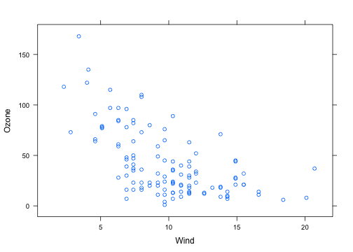
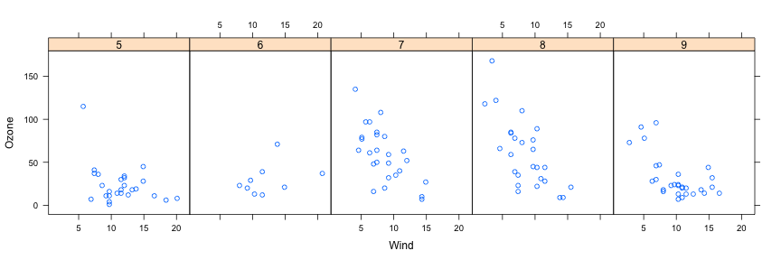
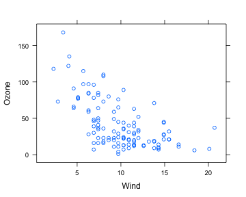
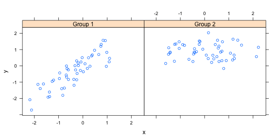
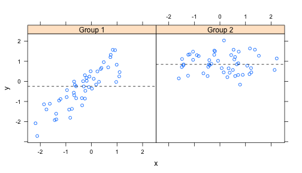
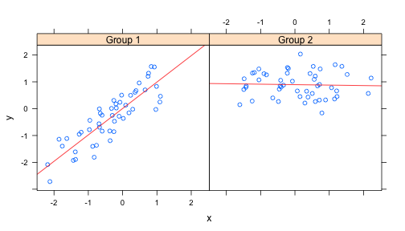
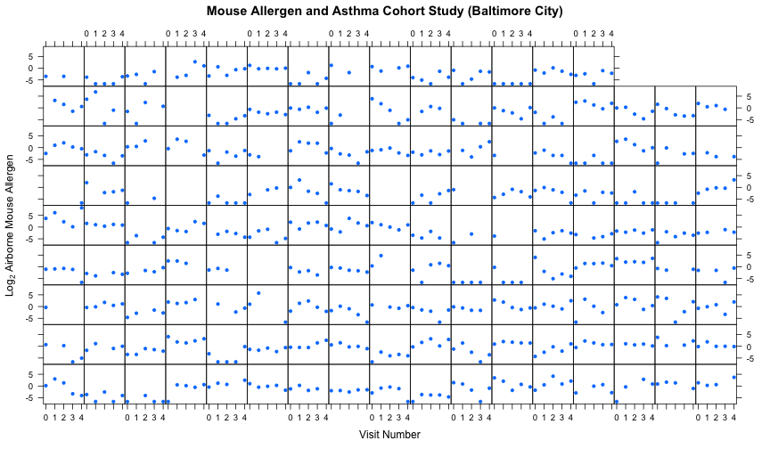

## The Lattice Plotting System

The lattice plotting system is implemented using the following packages:

- *lattice*: contains code for producing Trellis graphics, which are
   independent of the “base” graphics system; includes functions like
   `xyplot`, `bwplot`, `levelplot`

- *grid*: implements a different graphing system independent of the
   “base” system; the *lattice* package builds on top of *grid*
   - We seldom call functions from the *grid* package directly

- The lattice plotting system does not have a "two-phase" aspect with
  separate plotting and annotation like in base plotting

- All plotting/annotation is done at once with a single function call


---

## Lattice Functions

- `xyplot`: this is the main function for creating scatterplots 
- `bwplot`: box-and-whiskers plots (“boxplots”)
- `histogram`: histograms
- `stripplot`: like a boxplot but with actual points 
- `dotplot`: plot dots on "violin strings"
- `splom`: scatterplot matrix; like `pairs` in base plotting system 
- `levelplot`, `contourplot`: for plotting "image" data

---

## Lattice Functions

Lattice functions generally take a formula for their first argument, usually of the form

```r
xyplot(y ~ x | f * g, data)
```

- We use the *formula notation* here, hence the `~`.

- On the left of the ~ is the y-axis variable, on the right is the
  x-axis variable

- f and g are _conditioning variables_ — they are optional
  - the * indicates an interaction between two variables

- The second argument is the data frame or list from which the
  variables in the formula should be looked up

  - If no data frame or list is passed, then the parent frame is used.

- If no other arguments are passed, there are defaults that can be used.

---
## Simple Lattice Plot


```r
library(lattice)
library(datasets)
## Simple scatterplot
xyplot(Ozone ~ Wind, data = airquality)
```

 


---

## Simple Lattice Plot


```r
library(datasets)
library(lattice)
## Convert 'Month' to a factor variable
airquality <- transform(airquality, Month = factor(Month))
xyplot(Ozone ~ Wind | Month, data = airquality, layout = c(5, 1))
```

 


---

## Lattice Behavior

Lattice functions behave differently from base graphics functions in
one critical way.

- Base graphics functions plot data directly to the graphics device
  (screen, PDF file, etc.)

- Lattice graphics functions return an object of class **trellis**

- The print methods for lattice functions actually do the work of
  plotting the data on the graphics device.

- Lattice functions return "plot objects" that can, in principle, be
  stored (but it’s usually better to just save the code + data).

- On the command line, trellis objects are *auto-printed* so that it
  appears the function is plotting the data

---

## Lattice Behavior


```r
p <- xyplot(Ozone ~ Wind, data = airquality)  ## Nothing happens!
print(p)  ## Plot appears
```

 


```r
xyplot(Ozone ~ Wind, data = airquality)  ## Auto-printing
```


---

## Lattice Panel Functions

* Lattice functions have a **panel function** which controls what
  happens inside each panel of the plot.

* The *lattice* package comes with default panel functions, but you
  can supply your own if you want to customize what happens in each
  panel

* Panel functions receive the x/y coordinates of the data points
  in their panel (along with any optional arguments)


---

## Lattice Panel Functions


```r
set.seed(10)
x <- rnorm(100)
f <- rep(0:1, each = 50)
y <- x + f - f * x + rnorm(100, sd = 0.5)
f <- factor(f, labels = c("Group 1", "Group 2"))
xyplot(y ~ x | f, layout = c(2, 1))  ## Plot with 2 panels
```

 


---

## Lattice Panel Functions


```r
## Custom panel function
xyplot(y ~ x | f, panel = function(x, y, ...) {
    panel.xyplot(x, y, ...)  ## First call the default panel function for 'xyplot'
    panel.abline(h = median(y), lty = 2)  ## Add a horizontal line at the median
})
```

 


---

## Lattice Panel Functions: Regression line


```r
## Custom panel function
xyplot(y ~ x | f, panel = function(x, y, ...) {
    panel.xyplot(x, y, ...)  ## First call default panel function
    panel.lmline(x, y, col = 2)  ## Overlay a simple linear regression line
})
```

 


---

## Many Panel Lattice Plot: Example from MAACS

* Study: Mouse Allergen and Asthma Cohort Study (MAACS)

* Study subjects: Children with asthma living in Baltimore City, many
  allergic to mouse allergen

* Design: Observational study, baseline home visit + every 3 months for a year.

* Question: How does indoor airborne mouse allergen vary over time and
  across subjects?


[Ahluwalia et al., *Journal of Allergy and Clinical Immunology*, 2013](http://www.ncbi.nlm.nih.gov/pubmed/23810154)

---

## Many Panel Lattice Plot

 


---

## Summary

* Lattice plots are constructed with a single function call to a core
  lattice function (e.g. `xyplot`)

* Aspects like margins and spacing are automatically handled and
  defaults are usually sufficient

* The lattice system is ideal for creating conditioning plots where
  you examine the same kind of plot under many different conditions

* Panel functions can be specified/customized to modify what is
  plotted in each of the plot panels

