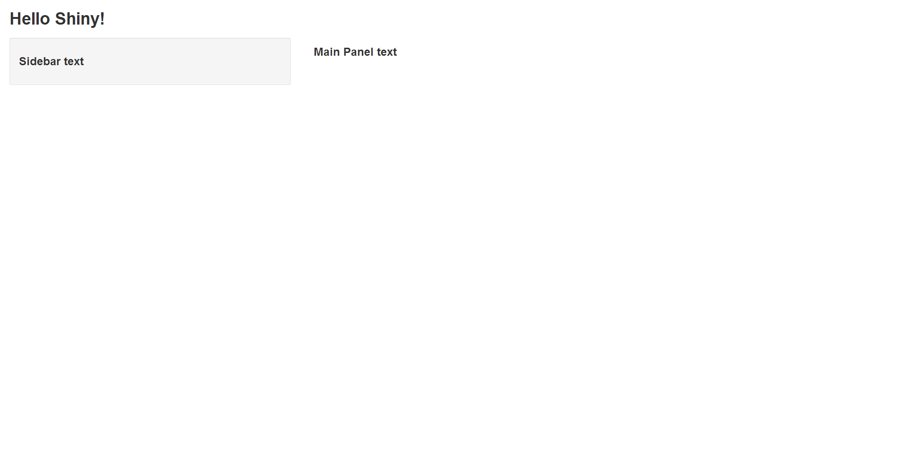

## What is Shiny?

- Shiny is a platform for creating interactive R programs embeded into a web page.
- Suppose that you create a prediction algorith, with shiny you can *very easily* create web input form that calls R and thus your prediction algorithm and displays the results.
- Using Shiny, the time to create simple, yet powerful, web-based interactive data products in R is minimized.
  - However, it lacks the flexibility of full featured (and more complex) solutions.
- Shiny is made by the fine folks at R Studio.

---
## Some mild prerequisites 
- Shiny doesn't really require it, but as with all web programming, a little knowledge of html, css and js is very helpful
  - html gives a web page structure and sectioning as well as markup instructions
  - css gives the style
  - js for interactivity
- There are too many tutorials online to count for getting basic proficiency in these topics to count. 
- Shiny uses [bootstrap](http://getbootstrap.com/) (no relation to the statistics bootstrap) style, which (to me) seems to look nice and renders well on mobile platforms

---
## What else is out there?
- Full solutions requiring real knowledge of web client/server programming
- [OpenCPU](https://public.opencpu.org/) by Jerome Ooms, a really neat project providing an API to call 

---
## Context
- You created a novel prediction algorithm to predict risk for developing
  diabetes.
    - You're hoping patients and caregivers will be able to enter their data and, if needed, take preventative measures.
- You want to create a web site so that users can input the relevant predictors and obtain their prediction.
- Your prediction algorithm (ok, so you're not going to be saving the world with this one)
  - (link for a real prediction score)[http://www.ncbi.nlm.nih.gov/pubmed/12610029]

```r
diabetesRisk <- function(glucose) {
    runif(1)
}
```


---
## Getting started
- Make sure you have the latest release of R installed
- If on windows, make sure that you have Rtools installed
- `install.packages("shiny")`
- `libray(shiny)`
- Great tutorial at 
[http://rstudio.github.io/shiny/tutorial/](http://rstudio.github.io/shiny/tutorial/)
- Basically, this lecture is walking through that tutorial offering some of our insights
- Note, some of the proposed interactive plotting uses of Shiny could be handled by the very simple `manipulate` function [rstudio manipulate](http://www.rstudio.com/ide/docs/advanced/manipulate)
- Also, `rCharts` is will be covered in a different lecture.

---
## A Shiny project
- A shiny project is a directory containing at least two parts
  - One named ui.R (for user interface) controls how it looks.
  - One named server.R that controls what it does.

---
## ui.R
```
library(shiny)
shinyUI(pageWithSidebar(
  headerPanel("Data science FTW!"),
  sidebarPanel(
    h3('Sidebar text')
  ),
  mainPanel(
      h3('Main Panel text')
  )
))
```

---
## server.r
```
library(shiny)
shinyServer(
  function(input, output) {
  }
)
```

---
## To run it
- In R, change to the directories with these files and type `runApp()`
- or put the path to the directory as an argument
- It should open an browser window with the app running

---



